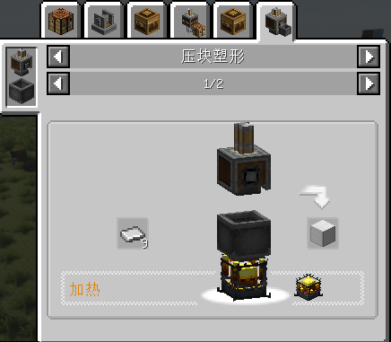
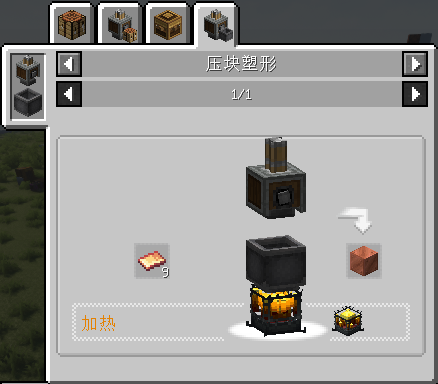
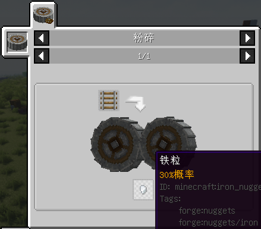
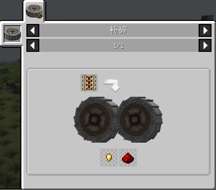
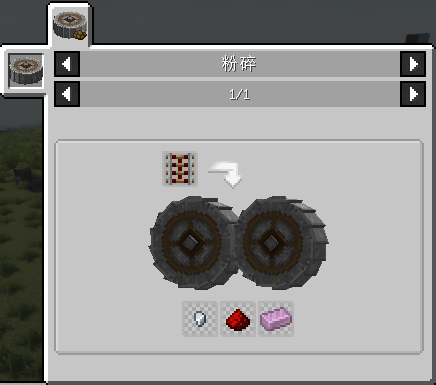

# byTTPeter_Recipe changes doc

## 1.0.0

### Name Tag

Tips:

1. `forge:string`
2. `forge:ingots`

### Elytra

Tips:

1. `minecraft:wither_skeleton_skull`

## 1.0.1

### For water logged sieves

Tips:

1. `minecraft:hay_block` is an item of tag `byttpeter_recipe:grain/compressed`
2. Items of `Farmer's Delight` is considered.

### For sieves

(not water logged)

Tips:

- The same as the above.

## 1.0.2

### Sheets and Blocks

### Rails

### Tripwire Hook

